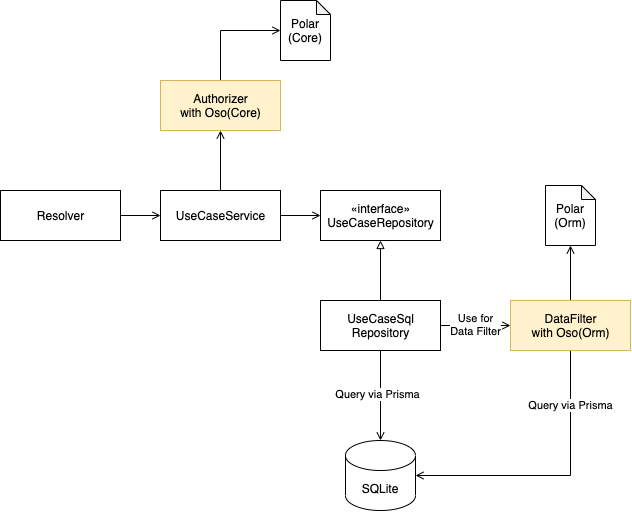
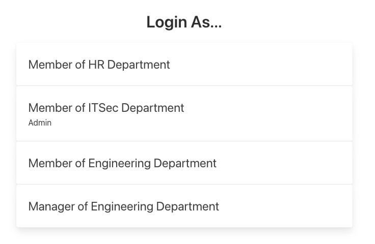

[](https://github.com/kenfdev/hr-sample-app/actions/workflows/main.yml)
# HR sample web application using Oso as AuthZ

A sample web application to show how you can integrate Oso.

Here are some demo Gifs to see how the app looks like:
- [Login with HR user](assets/oso_demo_hr.gif)
- [Login with Admin non-HR user](assets/oso_demo_admin.gif)
- [Login with non-Admin non-HR user](assets/oso_demo_non_admin.gif)

The stack:

- Server
  - Node.js(TypeScript) + Express+ GraphQL + Prisma
- Client
  - React

## ERD


## Types of authorization

### Request-level authorization

- A request is authorized if it includes a `x-user-id` HTTP Header
  - Otherwise, `401` will be returned

### Resource-level authorization

- If the logged-in user is
  - a member of the HR department
    - the user
      - can view all the members of the organization
      - can edit all the members of the organization
  - not a member of the HR department
    - the user
      - can view members which belong to the same department
  - an admin user
    - the user
      - can use the admin features of the service (can be accessed from the user menu)

### Field-level authorization

- If the logged-in user is
  - a member of the HR department
    - the user
      - can view all the members' fields including private fields (such as salary)
      - can edit all the updatable fields including private fields (such as salary) 
  - not a member of the HR department
    - the user
      - can view other members' public fields only
      - can view private fields of the logged in user
      - can edit public fields of the logged in user (not private fields such as salary)
      - if is a manager of the department
        - can view private fields of the members of the department

## Architecture Overview



Basically:
1. The GraphQL Resolver receives a request
2. The Resolver invokes the UseCaseService's method
   1. The UseCaseService invokes the UseCaseRepository to fetch data
      1. The UseCaseRepository fetches data from SQLite (Calls the DataFilter if filtering is necessary)
   2. The UseCaseService enforces field-level authorization and returns results to the UseCaseController
3. The Resolver sends the response to the requester

### Why use 2 Oso instances?

This example creates 2 Oso instances:

* 1 for the ORM models
* 1 for the Core models

This is required because the ORM models' field names differ from the Core models. For example, the MemberOrm model from the Database has a `departmentId` field but the [Member](./server/src/members/shared/member.ts) model does not. Hence, the Polar differs:

The ORM Polar:

```sh
has_permission(user: User, "read", member: Member) if
  user.memberInfo.department.id = member.departmentId or
  user.memberInfo.department.name = "hr";
```

The Core Polar:

```sh
has_permission(user: User, "read", member: Member) if
  user.memberInfo.department.id = member.department.id or
  user.memberInfo.department.name = "hr";
```

Look how the field names `member.departmentId` and `member.department.id` differ. You can add `departmentId` to the Core models to use `member.departmentId`, but, imo field names shouldn't depend on tools and frameworks. They should be isolated (especially in the core domain).

### Where Oso is used

#### Data filtering

**authorizedQuery**

You can see the [authorizedQuery](https://docs.osohq.com/node/guides/data_filtering.html) being used in [repository implementations](https://github.com/kenfdev/hr-sample-app/blob/422bc189b010d8896f3fef04b726392453b1d1ef/server/src/members/list-all-members/repository/listAllMembersSqliteRepository.ts#L21). By using the `authorizedQuery` you can add more query options such as sort.

**authorizedFields**

[authorizedFields](https://docs.osohq.com/node/reference/api/classes/oso.oso-1.html#authorizedfields) can be found in UseCaseServices. It is used to [authorize request bodies](https://github.com/kenfdev/hr-sample-app/blob/422bc189b010d8896f3fef04b726392453b1d1ef/server/src/members/edit-member-detail/editMemberDetailService.ts#L30-L34) when there is a mutation request such as PATCHES.

**authorizedActions**

[authorizedActions](https://docs.osohq.com/node/reference/api/classes/oso.oso-1.html#authorizedactions) can be found in UseCaseServices. It is used to [check if the requester has permission to do an action to a specific resource](https://github.com/kenfdev/hr-sample-app/blob/422bc189b010d8896f3fef04b726392453b1d1ef/server/src/members/show-member-detail/showMemberDetailService.ts#L40-L50) (e.g. can the user update the resource?)

## How to start

### Server

```sh
cd server

# install dependencies
npm install

# seed the SQLite database
npm run db:reset

# start the server
npm run dev
```

### Client

```sh
cd client

# install dependencies
npm install

# start the front-end locally
npm run dev
```

### Start playing around

Access http://localhost:3030/login and you'll see a page like the one below:



Select a user and you will be logged in as the selected user for further requests.
